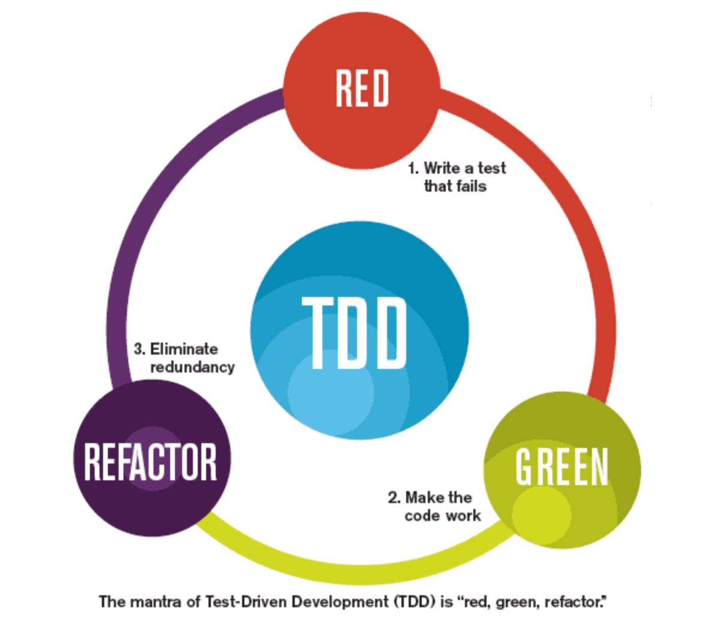
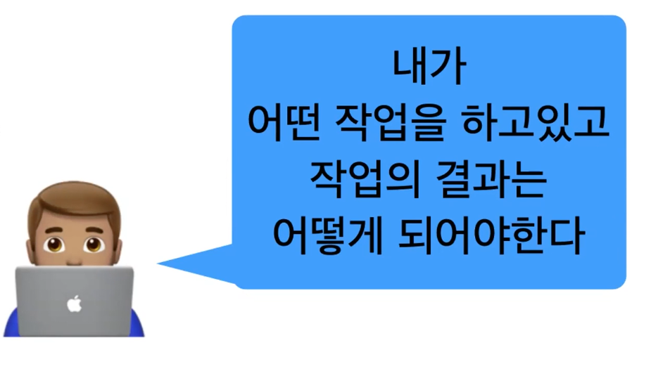

이번 글에는 지난 3월 29일 활동학습 시간에 배운 Unit Test와 Result 자료형에 대해 정리해보겠습니다.

## TDD가 뭘까?

일반적인 개발 프로세스는 디자인, 코드 작성, 자체 테스트의 순서로 이루어져 왔습니다. 하지만 이러한 방식은 자체 버그 검출 능력이 저하되는 문제, 소스코드 품질 저하의 문제, 자체 테스트 비용 증가의 문제를 야기시킵니다. 프로젝트의 초기 설계는 완벽할 수 없기 때문에 

TDD는 Test Driven Development의 약자로 매우 짧은 개발 cycle을 반복하는 개발 프로세스입니다. TDD의 Cycle을 그림으로 나타내면 다음과 같습니다. 

첫 단계인 RED 단계에서는 동작하지 않는 코드를 작성합니다. 이후 GREEN 단계에서는 RED 단계 때 작성한 코드를 동작이 가능하도록 먼저 수정합니다. 이 때 단순히 동작만 하도록 코드를 변경하면 필요없는 부분이 남아있을 수 있으므로 이를 REFACTOR 단계에서 다듬어줍니다. (REFACTOR는 코드의 로직 변경이 이루어지지 않습니다)

## 테스트를 하면 무엇이 좋을까?

TDD를 통해 개발을 하면 자연스럽게 큰 단위의 문제를 작은 단위로 나누게 됩니다.

"빠르게 실패하여 얻은 정보(피드백)를 바탕으로 개선하는 것" 이 TDD의 지향점입니다.

### 테스트는 훌륭한 스펙 정의 문서가 된다

테스트 케이스들을 통해 메서드가 어떤 한계점을 가지고 있는지에 대해 알 수 있습니다. 

### 테스트를 하지 않으면 코드를 수정(리팩토링)하기 어렵고 두려워진다

Refactor: Improve the Design of Existing Code

### 기능을 다 구현 해놓고 테스트를 마지막에 작성하면 안될까?

테스트 코드를 작성하는 것 = 내가 개발 스펙을 제대로 이해했다

이 코드가 어떻게 동작해야 하는지를 인지했다

코드 테스트를 위해선 어떤 것을 만들어 낼 것인지에 대한 충분한 이해가 필요하며, 명확하고 구체적인 목표를 가지고 진행해야 합니다. 또한 빠른 피드백과 피드백에 따른 반응을 통해 코드를 수정하기가 수월해집니다.

### Unit Test

유닛 테스트는 소스 코드의 특정 모듈이 의도대로 정확히 작동하는지를 검증하는 절차입니다. 모든 함수와 메소드에 대한 테스트 케이스를 작성하는 절차이며 언제라도 코드 변경으로 인해 문제가 생길 경우 짧은 시간 내에 이를 파악하고 바로 잡을 수 있도록 도와줍니다. 이상적으로 모든 테스트 케이스는 서로 분리되어야 하며 이를 위해 가짜 객체(Mock object)를 생성하는 것도 좋은 방법입니다.

### 어떤 테스트를 작성해야할까?

여러가지 방법론이 존재하는데 그 중 FIRST와 Right - BICEP 전략을 소개해보겠습니다.

### FIRST 방법

- Fast : 테스트는 빠르게 동작해야한다.
- Independent : 테스트는 독립적으로 진행되어야한다.
- Repeatable : 
- Self-validating : 
- Timely : 

 독립적으로 동작해야 합니다.

### 이 좋은 TDD를 왜 현업에선 사용하지 않고 있을까?

### 글 작성을 위해 참고한 링크

[TDD 10가지 팁](https://medium.com/@rinae/tdd-test-driven-development-%EB%A5%BC-%EC%97%B0%EC%8A%B5%ED%95%98%EB%A9%B4%EC%84%9C-%EC%B0%B8%EA%B3%A0%ED%95%98%EA%B8%B0-%EC%A2%8B%EC%9D%80-%ED%8C%81-10%EA%B0%80%EC%A7%80-d8cf46ae1806)

[선택이 아닌 필수 TDD](https://ahea.wordpress.com/2018/09/10/%EC%84%A0%ED%83%9D%EC%9D%B4-%EC%95%84%EB%8B%8C-%ED%95%84%EC%88%98-tdd/)

[카카오헤어샵의 TDD](https://brunch.co.kr/@cg4jins/9)

[Test 관련 용어 정리](https://johngrib.github.io/wiki/test-terms/#fnref:devops-handbook-180:2)

[Error를 Throw하는 테스트 케이스 다루는 법1](https://www.appsdeveloperblog.com/unit-testing-code-that-throws-error-in-swift/)

[Error를 Throw하는 테스트 케이스 다루는 법1](https://jayeshkawli.ghost.io/try-catch-blocks-and-unit-tests-in-swift-3-0/)