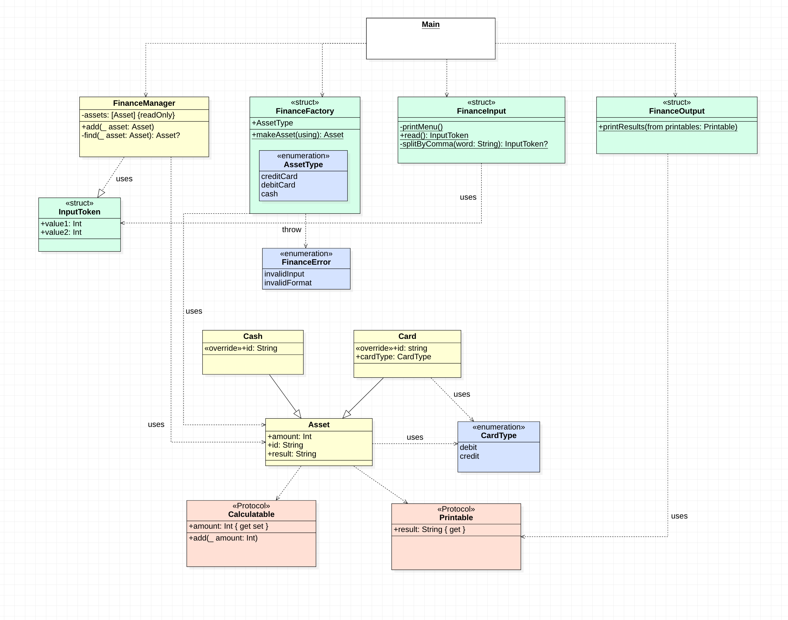

### 오늘 공부한 내용

- 응집도와 결합도

  "응집도를 높이고 결합도를 낮춰라"

  라는 말의 의미에 대해 생각해봤습니다.

  > 각 클래스 메서드는 클래스 인스턴스 변수를 하나 이상 사용해야 한다. 일반적으로 메소드가 변수를 더 많이 사용 할 수록 메서드와 클래스의 응집도가 더 높다. . . . (중략) . . . 응집도가 높다는 말은 클래스에 속한 메소드와 변수가 서로 의존하며 논리적인 단위로 묶인다는 의미기 때문이다.(클린코드 177쪽)

  결합도를 쉽게 풀어서 말하면 상호의존도로 생각해볼 수 있을 것 같았습니다.

- UML을 그리는 법

  

  UML 그리는 법을 리뷰어 "흰"을 통해 배웠습니다.

  누군가에게 나의 코드를 설명할 때나 어떤 프로젝트를 분석할 때 UML은 훌륭한 의사소통 수단이 될 수 있음을 알 수 있었습니다.

  [링크](https://gist.github.com/daheenallwhite/9858250a2c81f8bb97946cbde6a6d167)의 예제 코드를 통해 UML을 직접 그려보는 시간을 가졌습니다.

  

- 프로토콜

  프로토콜의 개념과 사용법에 대해 공부해보았습니다.

  프로토콜을 통해 협업 시에 더 원활한 코드의 청사진 기능을 사용할 수 있겠다 싶었습니다.

  이번 계산기 프로젝트부터 이를 활용해 볼 예정입니다.

- 문자열 상수를 모아놓는 container의 필요성에 대해 알게되었습니다

  문자열을 코드마다 개별적으로 관리하면 문자열의 수정이 어렵다는 단점이 있었습니다

  이를 해결하기 위해 문자열을 묶어서 관리하는 방법이 있다는 것을 알게되었습니다.

