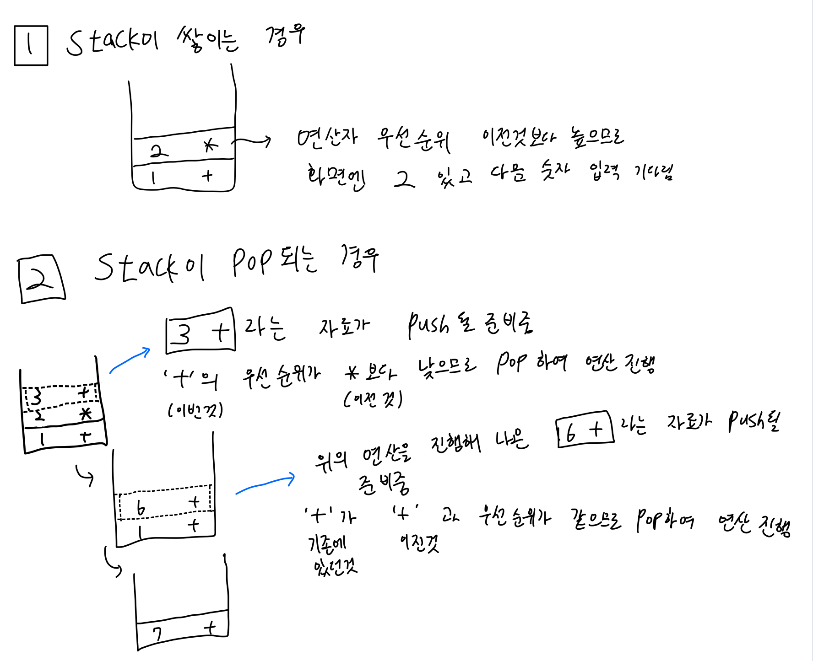

## 오늘 공부한 내용

### 붱이의 SOLID 원칙 강의를 들었습니다

SOLID관련 개념에 대해서는 추후 포스팅 예정입니다.

  

### 계산기 프로젝트 Step1 PR을 보냈습니다

- 2진수의 음수 표현을 위해 2의 보수로 변환하는 과정에 대해 고민했습니다

- Double로 출력시 의미없는 소수점 뒷자리 (10.0 과 같이 0이 붙음) 를 출력하지 않을 방법을 `NumberFormatter`class를 활용하여 해결했습니다

- 연산자의 우선순위에 대해 공부했습니다.

  Swift 공식문서의 연산자 precedence값을 참고하여 코드에 반영했습니다.

- 계산기의 Stack을 활용하여 로직을 처리할 방안을 구상했습니다.

  

  

## 고민한 내용

### 상속과 프로토콜 언제 어떤걸 써야할까?

오늘 붱이의 SOLID강의를 들으며 가장 궁금했던 주제입니다.

대체 상속과 프로토콜은 어떻게 선택하여 사용하는걸까?

사실 프로토콜은 반드시 따라야하는 규약을 정해주는 것이고

상속은 부모 클래스의 것들을 가져다 쓸 수 있다는 점에서 근간부터가 다르지만

오늘 붱이가 보여준 예제는 분명 상속만으로도 충분히 기능적 해결이 가능했었습니다.

그럼에도 불구하고 프로토콜과 추가 Class를 이용하였는데 이것이 상속을 활용하는 것과 어떻게 다른지에 대해서 고민해보았습니다.

  

### 모든 프로젝트의 틀을 잡고 시작할 수 있을까?

이번 계산기 프로젝트를 진행하며 여러가지 난관에 부딪히고 있는데 그 중 하나가 바로 

"모든 프로젝트의 완성품을 알고서 그것에 맞게 설계하는 것이 가능할까?" 였습니다.

만약 완성품의 모습을 알고 있더라 하더라도 그 완성품의 모습을 고려하여 처음부터 설계를 빡세게 할 수 있을까? 와 같은 고민을 하고 있던 찰나 `mason`의 조언을 받았습니다.

현업에서 완성품의 모습을 알고서 프로젝트를 진행하는 것을 사실상 불가하고 진행 중 리팩토링을 하는 경우가 많으니 다음 스텝을 예상하지 말고 코드를 짜보라는 조언이었습니다.

  이 말의 뜻을 이해해보자면

다음 스텝을 고려하지 말고 바보같이 코드를 짜라

가 아니라

다음 스텝을 예상하지 않고 코드를 짰을때도 다음 스텝에서의 적용이 원활하도록 코드를 짜라

로 들렸습니다.

조언을 통해 프로젝트 진행방향의 갈피를 잡을 수 있었습니다.

  

## 내일 공부할 내용

- SOLID 원칙 공부
- Unit Test, TDD 예습
- 운영체제 3강 수강
- 네트워크 2강 수강

