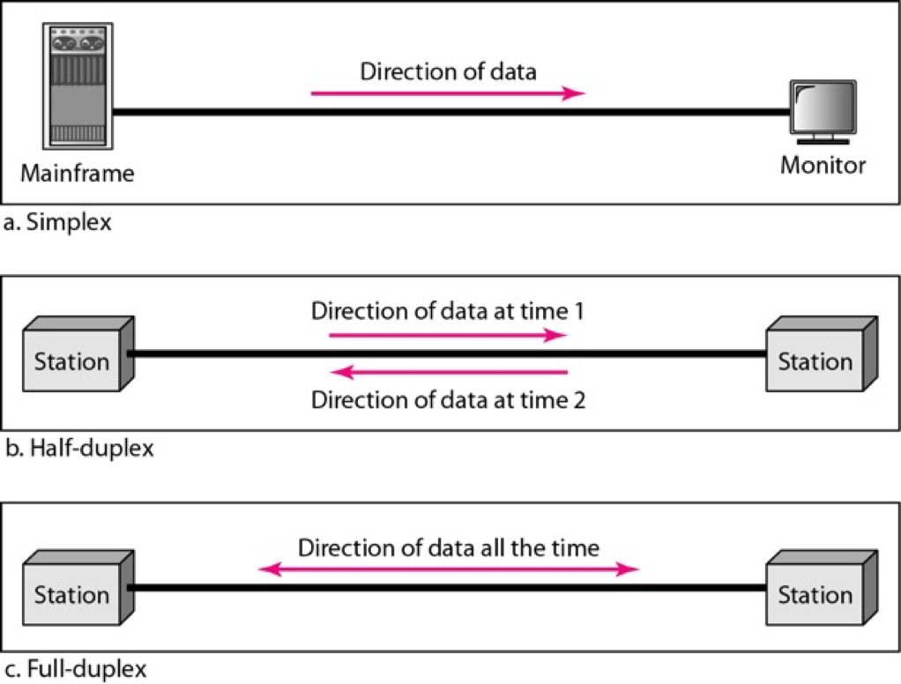
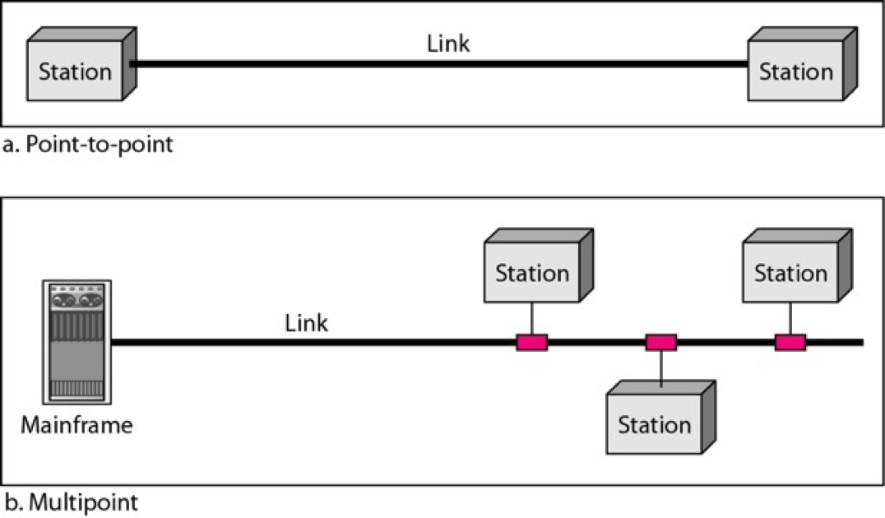
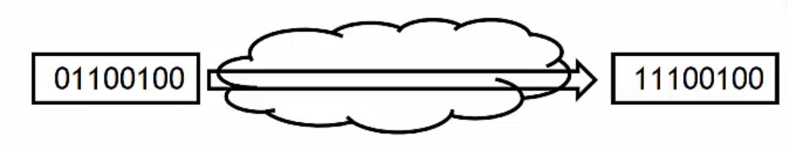
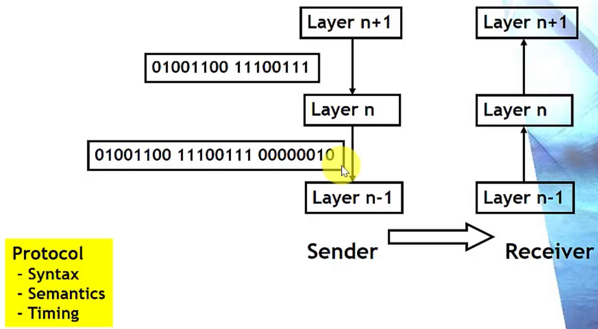
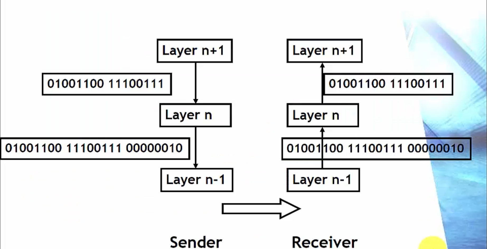
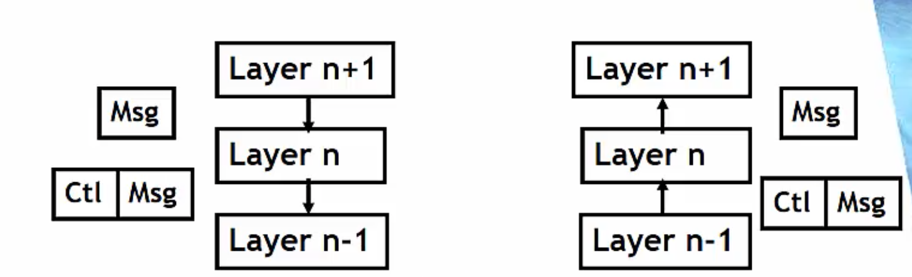
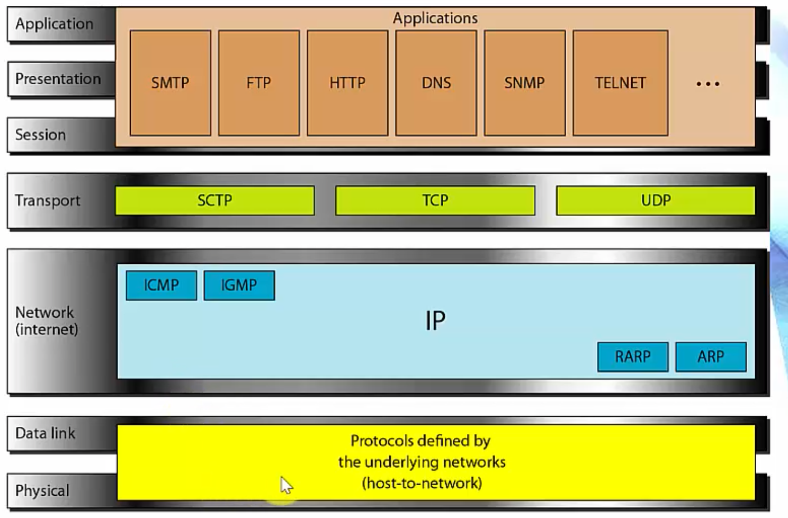

## Communication & Network

---

> - Communication is exchange of information between users(stations, nodes) at a distance
>
> - Network
>
>   A system consists of devices (often referred to as nodes) and links for transportation of entities
>
>   Examples: roads, railroads, water  
>   
>   
>   
> - Two Types of communication networks
>
>   Voice
>
>   Computer networks  
>

 

통신(communication) : 멀리 떨어진 사용자(사람, 서버, 스마트폰, 컴퓨터 등등) 사이의 정보 교환 

네트워크: entity()를 운반하기 위한 시스템 -> node와 링크로 구성된 시스템

ex) 도로, 수도망 등등

컴퓨터 네트워크: 정보를 운반하는 네트워크

네트워크의 두 종류

voice: 전화망, 음성신호를 움직이는 망

1980년대까지는 주력이 되었던 시스템이지만 점점 사라져가는중

스마트폰으로 하는 전화는 더이상 Voice(전화망)이 아닌 컴퓨터 네트워크로 바뀜

computer networks: digitize된 정보를 움직이는 네트워크

---

 

## Connectivity

---

> - Impossibale to connect (large) number of users directly
>
>   (If link directly) 
>
>   Requires
>
>   O(N^2) links
>
>   O(N) accsess link / user
>
> - Share resources(links)
>
>   Network is a mechanism to make the connectivity easy by sharing resources
>
> - Sharing mechanisms
>
>   Multiplexing
>
>   Access control  
>

 

모든 사용자를 direct하게 연결할 수 없음

따라서 리소스를 sharing 해서 효율적으로 연결을 만들어줌

리소스 sharing의 두 가지 방법에는 멀티플렉싱과 엑세스 컨트롤이 있음

복잡도를 낮추고 효율성을 높일 수 있음

---
 

## Simplex/Duplex

---

통신 시스템은 Simplex/ Half duplex/ Full duplex가 있음

Simplex 시스템은 단방향으로만 가는 시스템

Half duplex는 한 시점에 한 방향으로만 data를 보낼 수 있는 시스템 (wireless같은 경우에 발생할 수 있음)

Full duplex는 두 station이 동시에 data를 주고받고 할 수 있는 시스템

---
 

## Link Types

---

point-to-point 링크는 링크 양쪽에 station이 하나씩 있음

link를 직접 쓸 수 있는 node는 끝에 달린 station

(Multiplexing 기법을 이용해서 운용, 여러 station이 한 링크를 공유)  

 

Multipoint는 한 링크에 station이 여러개 달려있음

station이 보내는 정보가 broadcast됨

링크에 붙어있는 모든 station이 정보를 받을 수 있음

information이 다 퍼지기 때문에 broadcast link 라고도 함  

 

문제점: 두개 이상의 station이 신호를 보내면

electric magnetic인 link에서 충돌이 일어남

따라서 한 시점에 한 station만 전송을 할 수 있음

Access Control: 위와 같은 상황 방지를 위해 동시에 여러 station이 전송하지 못하도록 막는 것  

 

Link는 connectivity를 제공

이 자원을 어떻게 활용할 것인가?

1. p-p는 멀티플렉싱
2. 멀티포인트는 엑세스 컨트롤을 사용  

 

Station들의 로직이 있는데 

p-p 방식은 station에서 multiplexing/demultiplexing 진행됨

multipoint 방식은 station에서 access control 진행됨

---
 
## Architecture

---

> - Divide&Conquer
>
>   To solve a large & complex problem, first partition the problem into small pieces
>
>   Solve each partial problem
>
>   Combine sub-solutions into a whole solution
>
> - Architecture
>
>   A set of sub-functions that comprise a larger function
>
> - Abstaction
>
>   Shield internal implementation details and show only interfaces
>
> - Example
>
>   Program modules  
>

아키텍쳐는 컴퓨터의 instruction set이 어떻게 되어있는가 등을 나타냄

분할정복 방법은 크고 복잡한 문제를 풀기 위해 해결가능할 정도로 잘게 쪼갬

그 뒤에 각각의 작은 문제들의 해답을 합쳐서 전체 문제의 솔루션으로 만드는 일을 함

partition, solve, combine

작은 문제들이 서로 협력하여 큰 문제를 풀어냄

아키텍쳐: 큰 기능을 수행하기 위한 작은 function들의 set  

 

작은 기능들이 상호작용을 통해 큰 기능을 수행하게 되는데

상호작용을 쉽게 하기 위해 추상화를 사용

procedure한 일을 각각 하게 되는데 이 구현의 세세한 부분을 보여주지 않음

이것들이 모여 큰 기능을 하게 되는게 아키텍쳐

---

 

## Layered Architecture (계층구조)

----

> - Layered architecture
>
> - Keep the interaction simple

통신을 여러개의 모듈로 나누는데

통신은 사람이 쓰는(어플리케이션이 쓰는)

electro magnetic signal(가장 하부)에서

사람이 쓰는 level까지 올라가기 위해서는 해결해야 할 문제가 많음

그 문제들이 점점 더 고급화되는식으로 자연적으로 modeling이 될 수 있음  

 

Layer N - 가장 abstract가 많이 된 계층 (바로 사람이 쓸 수 있는 프로토콜)

Layer n+1

Layer n 

Layer n-1

가장 낮은 Layer - magnetic signal을 다루는 쪽  

 

layer위로 갈수록 abstraction이 진행되고

각각의 layer는 각자의 일도 수행함  

---

 

## Protocol

---

> - Communications involve two or more devices
>
> - Suppose A and B communicate each other
>
>   Should A and B use the same program?
>
>   If A and B use Windows and Linux OS respectively, how they communicate?
>
> - Protocol
>
>   Rules that communicating entiites should abide to understand and properly process messages received
>
> - Not that communication is exchanges of messages
>
>   Protocol specifies the meaning (semantics and syntax of message)
>
>   And timing of messages   
>

통신은 2개 이상의 유저/station이 정보를 교환하는 것

A와 B가 통신을 할 때

A와 B가 똑같은 프로그램을 써야하는가?

어떻게 통신할 것인가?  

 

그래서 프로토콜이 필요함

프로토콜: 통신하기 위해 메세지를 주고받을텐데 

symbolize된 추가적인 정보를 보내줘야 함

추가적인 정보가 network 기능을 하기 위해 필요함

공통의 규칙과 메세지를 이해하는 rule이 필요함

이것이 바로 프로토콜  

 

프로토콜을 semantics/syntax/timing으로 구성되어있음

메세지를 주고받을 때 

프로토콜에 따라 메세지 보내면

상대편은 프로토콜에 따라 해석함

---
 

## Protocol - Example1

---

> - Error detection
>
>   Communication links are not 100% reliable
>
>   Errors may change, add, delete bits in the original message
>
>   An Internet bank user C requests to transfer $100 from account A1 to A2
>
>   If the first bits is changed to 1, then you transfer $228
>
>   
>
> - How do you detect errors?
>
>   There ar many solutions
>
>   - Parity bit
>   - One's complement addition
>   - CRC  
>

프로토콜의 개념이 추상적이기 때문에

에러 탐지라는 기능 중 하나임

커뮤니케이션 링크의 신뢰도는 100%가 아님

모든 정보는 비트로 되어있는데 비트가 바뀌는 경우도 있고

비트가 추가되거나 빠지거나 하는 경우가 있음

보통 전화망에서는 에러가 일어나면 사람이 스스로 보정할 수 있지만

컴퓨터는 flexible하지 않기 때기 때문에 스스로 처리 불가능  

 

오류탐지 방법

1. 페리티 비트
2. One's Complement addition
3. CRC: 물리계층에서 frame에 에러가 있는지 없는지 검사

---

 

## Protocol - Example 2

---

> - We need to agree
>
>   Use the same method
>
>   How to apply the method
>
>   How to represent additional data
>
> - Assume we agreed to
>
>   1. Even parity bit
>   2. Apply parity to every bytes
>   3. Attach parity bits to the end of the original message as a byte stream  
>
>   
>

오류 탐지를 하기 위해서는 서로 결정/동의해야하는 사항들

1. 같은 오류탐지 방법을 쓰는 것에 대한 동의 (표준화 과정)
2. 어떻게 쓸지에 대한 결정 (어떤식으로 표현할 것인가)  

​	 

보통 새로운 오류탐지 방법에 대해 공부함

어떻게 쓸지에 대한 것은 크게 어렵지 않음

---

  

## Protocol - Example 3

---

> - Suppose layer n performs error detection
>

Sender가 원래 메세지에 Parity bit을 하단 Layer에 계속 붙여줌

Receiver 쪽에서 이것을 판단함

의문의 에러를 탐지할 가능성이 낮을수록 안좋은 프로토콜

따라서 Parity bit은 그닥 좋은 프로토콜이 아님

하지만 CRC나 다른 프로토콜은 오류를 놓칠 확률이 매우 낮음 -> 좋은 프로토콜  

 

Sender와 Receiver가 같은 프로토콜을 사용해야 통신할 수 있다

Syntax, Semantics, Timing이 모두 일치해야함

---

   

## Protocol Principle - 1

---

#### Protocol Principle

> Message that layer n generates at the sender
>
> ​	=
>
> Message that layer n receives at the receiver

- Good protocols abide the protocol principle
- Why is the *protocol principle* important in designing protocols?  

 

Protocol principle: 프로토콜을 디자인 할 때 가장 중요한 것

Layer n에서 보내는 메세지와 Layer n에서 받는 메세지가 똑같아야 한다

Protocol principle을 반드시 따르도록 하는것이 중요

Protocol principle이 protocol design하는데 중요한 이유: 

보내는 쪽의 data와 받는 쪽의 data가 다르다면 바뀐 부분에 대해 신경을 많이 써야함

(해석하기 어렵게 바뀐 부분들 난감)

---

 

## Protocol Principle - 2

---

Layer n이 error detection 한다고 가정

layer 내려갈수록 정보를 붙여줌

하지만 같은 layer 입장에서는 같은 정보를 주고받는 형식이 됨

sender와 receiver는 마치 직접통신한 것과 같은 효과가 나타남

---

 

## Virtual communication

---

> - Two layer entities at the same level think they communicate directly
> - In fact, a message goes down and up lower layers at the sendr and the receiver  
>

Message 옆에 붙어있는 Control: 보통 Header/PCI(Protocol Controll Information)라고 불리며 이를 Message에 붙이는 방식으로 해당 Layer의 고유한 기능을 수행함

---

 

## Standard Protocols

---

> - To communicate, should use the same protocol  
>
> - Proprietary protocols
>
>   Created (usually) by one or more companies
>
>   Colsed protocol
>
>   ​	- Protocol is hidden or the owner may clain IPR  
>
> - Open protocol
>
>   Specifications are open to the public and everyone can use free  
>
> - Standard protocol
>
>   Open protocol that many agree to use  
>
> - Examples of standard protocols
>
>   ISO, OSI
>
>   IEEE LAN, WLAN, ...
>
>   TCP/IP
>
>   ...  
>

 

통신은 혼자 하는 것이 아님

같은 프로토콜을 써야 통신이 가능함 상호운용, 이해 가능

회사 고유의 작업을 위해 프로토콜을 만들기도 함

하지만 전세계적으로 쓰려면 모두가 약속한 프로토콜이 필요함

스펙이 공개된 프로토콜 -> 누구든 implementation하면 다같이 이용가능  

---

 

## TCP/IP

---

Physical layer나 Data link layer는 TCP/IP에 포함되지 않음

IEEE layer나 point-to-point로 구성됨

그 위에 존재하는 것이 TCP/IP

Physical network를 연결하는 일을 하는 것이 IP  

 

IP는 forwarding/routing을 해줌

ARP(Address resolution protocol)

ICMP와 같은 중요한 일을 해줌

멀티캐스팅을 위한 IGMP등도 진행함 (RARP는 최근엔 거의 사용 X)  

 

IP계층을 지나게 되면 end에서부터 다른 세계의 end까지 datagram이 지나가게 됨  

 

그 위에서 Transport layer가 동작함

SCTP는 요즘 잘 안씀

TCP/UDP라는 두개의 동등한 계층의 프로토콜을 주로 사용하게 되는데

TCP는 복잡한 일, UDP는 간단한 일을 보통 하게 됨  

 

TCP: error control, congestion control

UDP: data 전송  

 

위 3개의 계층은 압축시켜 Application 계층이라고 부름

복잡한 layer로 나누지 않고 Application계층 안에서 해결하라고 주장하는 것  

 

Application에는 엄청나게 많은 프로토콜이 존재함

SMTP(이메일)

FTP(파일)

HTTP(웹)

DNS(도메인)

등 여러가지가 있음

---

