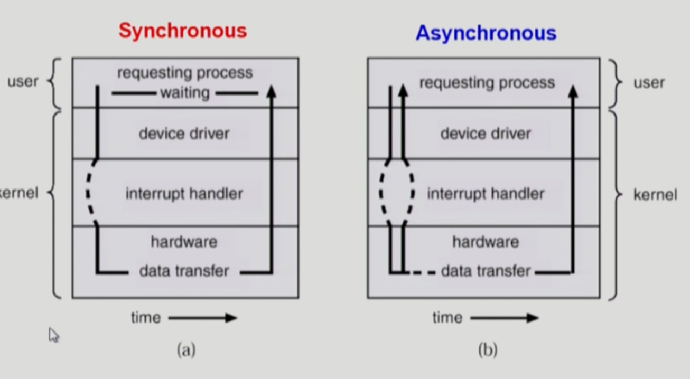

# System structure & program execution

개요

운영체제 들어가기 앞서

컴퓨터 하드웨어가 어떻게 동작하는지

프로그램들이 하드웨어 위에서 어떻게 작동하는지 설명하는 챕터

---

## 컴퓨터 시스템의 구조

컴퓨터(host): CPU와 메모리

I/O Device: 디스크, 모니터, 키보드 등..

메모리: cpu의 작업 공간

instruction: cpu에서 하는 일

cpu는 매 순간마다 기계어(instruction)를 Program Counter로부터 하나씩 읽어서 실행한다

디스크의 I/O Device적 특성 (데이터를 메모리로 읽어들임/처리결과 디스크 파일 시스템에 저장)

디바이스 컨트롤러: 디바이스마다 디바이스를 전담하는 작은 CPU

로컬 버퍼: I/O 디바이스 각각의 작업 공간

cpu와 I/O디바이스는 속도차이가 심함

따라서 I/O디바이스는 cpu가 담당하지 않고 디바이스 컨트롤러에게 권한을 줌

cpu는 메모리에서 instruction set하나씩 읽어오는게 운명

cpu에는 

레지스터라 부르는 메모리보다 빠른 공간 있음

지금 cpu에서 실행되는 것이 운영체제인지 사용자 프로그램인지를 구분해주는 mode bit이 있음

cpu는 instruction set만 계속 실행하기 때문에 interrupt line이 붙어있음

1. 프로그램이 I/O디바이스 관련 정보를 요청하면 디바이스 컨트롤러에게 CPU가 일을 시킴
2. I/O 디바이스는 컨트롤러의 지시를 받아서 명령을 처리한 뒤 로컬 버퍼에 저장함

이 시간동안 CPU는 자신의 일을 계속 하고 있음

로컬 버퍼의 내용은 interrrupt를 통해 전달

매 instruction set 읽을때마다 interruptline을 체크함!

만약 무한루프를 도는 프로그램이 cpu가 계속 넘어가있다면? -> 문제가 생김

컴이 처음 켜질때는 운영체제가 cpu가지고 있음

사용자 프로그램 시작하면 cpu를 넘겨줌

근데 이때 timer를 설정하여 넘겨주게 됨

이러면 사용자 프로그램은 독점적으로 계속 cpu를 쓸 수 없게됨

setting된 시간이 되면 timer가 cpu에게 interrupt를 걸어줌

이러면 cpu소유권이 사용자 프로그램으로부터 운영체제로 자동으로 넘어감

(이미 준 cpu 제어권을 뺏어올 수 없으니 하드웨어(timer)를 두어서 처리하는거임)

만약 무한루프 도는 프로그램 아니라 프로그램 끝나면 자동으로 cpu 반납함

I/O를 해야되는 프로그램의 경우

해당 시점에 운영체제에게 자진해서 cpu를 넘겨주게 됨

cpu는 직접 I/O 디바이스에 접근할 수 없음 (보안 등의 이유)

요청한 작업이 끝나면 I/O컨트롤러가 CPU에게 interrupt를 검

그러면 CPU 소유권이 OS로 넘어가게 되고

OS는 interrupt 내용을 확인해서

필요한 프로그램에게 copy를 해줌

OS는 다시 CPU 쓰던 프로그램에게 CPU 줌 (timer 확인하고 나서)

---

## Mode bit

Mode bit이

0이면 모니터 모드 or 커널 모드

라고 해서 OS가 CPU에서 수행중인 것

1이면 사용자 프로그램 모드

사용자 프로그램이 운영체제에 접근하거나 I/O에 직접 접근하려하면

mode bit이 1이라서 안되게 막음

0/1은 보안의 목적으로 나누어놓은 것

---

## Timer

프로그램에게 cpu를 줄 때 정해진 시간을 할당한 뒤에 넘겨주게 되는데

타이머가 다되면 인터럽트를 걸어 CPU를 뺐어올 수 있게 해놓음

---

## Device Controller

운영체제를 전담하는 작은 CPU

제어정보를 위한 레지스터: CPU가 일을 시킬 때 이 레지스터를 통해 명령을 지시함

데이터를 담는 로컬 버퍼: 담은 데이터를 넘겨주거나 화면에 출력하기 위해 데이터를 담아놓은 다음에 출력 

파일에 저장하고 싶다면 로컬버퍼에 담아놓은 것을 제어 레지스터가 저장해달라고 요청하고 CPU가 I/O 컨트롤러에게 전달하게 됨

메모리도 컨트롤러가 있음!

---

## DMA

cpu가 너무 인터럽트를 많이당하는 문제 해결하기 위해 DMA라는 컨트롤러를 두고 있음

I/O 장치가 너무 자주 인터럽트를 거니까 DMA가 중간중간 작업이 들어왔을 때 CPU는 자신의 작업을 계속 하게하고 DMA가 직접 메모리로 I/O디바이스가 보낸 내용을 옮겨줌

CPU가 중간에 인터럽트 당하는 비율이 줄어들음

---

Device driver: 각 디바이스 접근 처리를 위해 존재하는 소프트웨어 모듈

Device controller: 디바이스마다 전담하기 위한 작은 CPU장치 (하드웨어)

I/O에 접근해야되는 상황이 오면 디바이스 드라이버에게 명령

디스크 안에 펌웨어라고 하는 instruction code

---

## I/O의 수행

입출력 명령은 특권명령으로 정의됨

사용자 프로그램이 직접 I/O하지 못하고 운영체제를 통해서만 접근할 수 있음

시스템 콜: 운영체제에게 선언, 함수호출 요청하는 것

메인함수를 실행하는데 다른 함수를 호출하면

점프를 하게되는데 이건 interrupt 방식처럼 시스템콜이 이루어짐

interrupt는 I/O device가 걸수도 있고(하드웨어 인터럽트) 사용자 프로그램이 걸수도 있음(소프트웨어 인터럽트/트랩)

넓은 의미의 인터럽트는 둘다 포함하지만

보통은 하드웨어 인터럽트를 말하고

소프트웨어 인터럽트는 트랩이라는 용어로 부름

I/O 요청은 소프트웨어 요청과 하드웨어 요청 둘 다 필요함

cpu를 독점하는걸 막기 위해 timer 인터럽트를 사용하고

I/O가 쏴주는 I/O컨트롤러 인터럽트가 있음

현대의 운영체제는 인터럽트에 의해 구동된다! 라고도 함

운영체제는 CPU를 잡을 일이 없음 (항상 사용자 프로그램이 쓰고 있게 됨)

---

## 시스템 콜

사용자 프로그램이 운영체제의 서비스를 받기 위해 인터럽트 라인을 통해 커널 함수를 호출하는 것

사용자 프로그램이 바로 OS로 점프를 못하니 의도적으로 interrupt line을 setting하고 CPU의 제어권이 OS로 넘어가게 요청

---

## 인터럽트

Interrupt (하드웨어 인터럽트)

Trap(소프트웨어 인터럽트)

- Exception: 프로그램이 오류를 범한 경우
- System call: 프로그램이 커널 함수를 호출하는 경우

Timer Interrupt

여러 인터럽트 번호와 주소들의 쌍 (인터럽트 벡터)

해당 인터럽트를 처리하는 커널 함수 (인터럽트 처리 루틴, 실제 해야될 일)

---

## 동기식 입출력과 비동기식 입출력

> - 동기식 입출력 (synchronous I/O)
>
>   I/O에 요청 후 입출력 작업이 완료된 후에야 제어가 사용자 프로그램에 넘어감
>
>   구현 방법 1
>
>   1. I/O가 끝날 때까지 CPU를 낭비시킴
>   2. 매시점 하나의 I/O만 일어날 수 있음
>
>   구현 방법2
>
>   1. I/O가 완료될 때까지 해당 프로그램에게서 CPU를 빼았음
>   2. I/O 처리를 기다리는 줄에 그 프로그램을 줄 세움
>   3. 다른 프로그램에게 CPU를 줌
>
> - 비동기식 입출력 (asynchronous I/O)
>
>   I/O가 시작된 후 입출력 작업이 끝나기를 기다리지 않고 제어가 사용자 프로그램에 즉시 넘어감
>
> 
>
> ​	두 경우 모두 I/O의 완료는 인터럽트로 알려줌

동기/비동기에 대한 설명

I/O작업은 오래걸리는 작업

이걸 동기식으로 처리하려면 너무 오래걸림

따라서 비동기식으로 처리해야함

 

