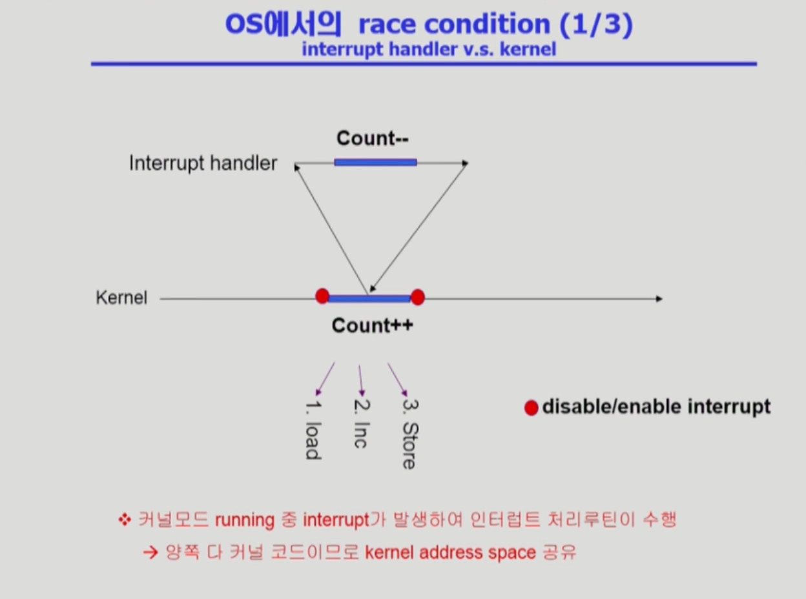
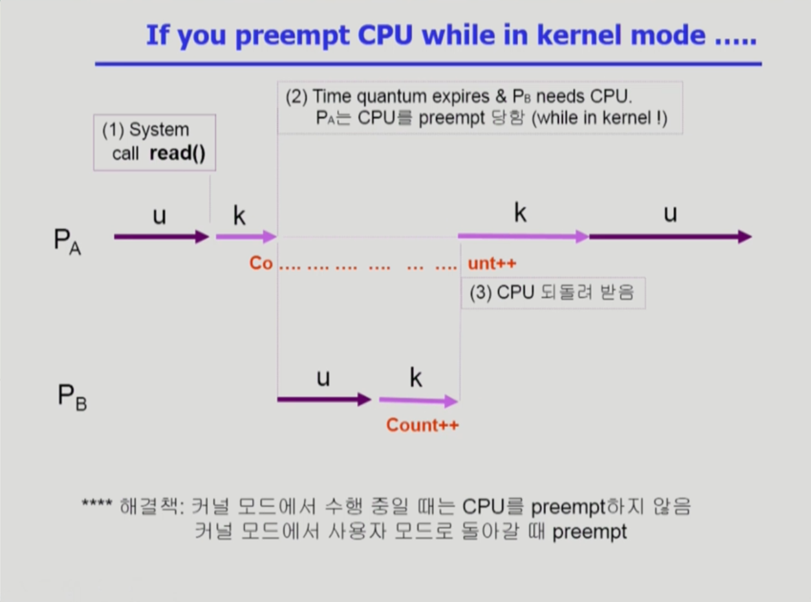
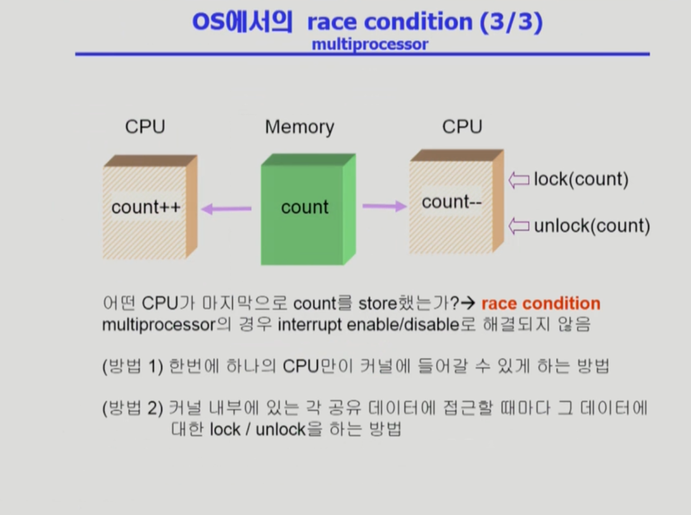

## 프로세스 동기화 문제

- 공유 데이터의 동시 접근은 데이터의 불일치 문제를 발생시킬 수 있다
- 일관성 유지를 위해서는 협력 프로세스 간의 실행 순서를 정해주는 메커니즘이 필요하다

## Race Condition

### Race Condition이 생기는 경우

1. 커널 작업 중 인터럽트 발생 시 
2. 프로세스가 시스템 콜을 하여 커널 모드로 수행중인데 문맥교환이 일어나는 경우
3. 멀티프로세서에서 공유 메모리 내의 커널 데이터

### 1. 커널 작업중 인터럽트 발생

커널 작업중 인터럽트가 발생하여 커널 내의 같은 변수에 접근하는 경우에는 커널 작업이 끝날때까지 인터럽트를 막음으로써 해결할 수 있다.

### 2. 시스템 콜 실행중 문맥교환이 일어나는 경우

P_A가 CPU를 사용하다가 Count라는 변수를 읽도록 지시하였는데 (시스템 콜을 통해) 그 사이에 할당시간이 만료되어 P_B가 CPU를 사용하게 되는 경우가 있다고 가정하자. 이때 P_B도 Count라는 같은 변수에 접근한다면 P_A는 P_B에 의해 바뀐 Count 값이 아닌 (이미 1 증가한 Count 값이 아닌) 기존의 Count 값을 증가한다. 이런 상황을 해결하기 위해 커널 모드에서 작업중인 경우에는 preempt(CPU를 뺏어가는 행위) 하지 않는다. 대신 커널 모드에서 사용자 모드로 돌아갈 때 preempt를 진행한다.

### 3. 멀티프로세서에서의 공유데이터 접근문제

멀티프로세서에서의 공유데이터 접근문제는 개별 데이터에 대해 lock을 걸어주는 방법이 있다. 다른 방법으로는 커널은 접근을 매 순간 하나의 CPU만이 할 수 있도록 하는 방법도 존재한다. 

## 임계구역 문제

임계구역(critical section) 문제는 n개의 프로세스가 공유 데이터를 동시에 사용하길 윈하는 경우에 발생한다. 

각 프로세스의 code segment 에는 공유 데이터를 접근하는 코드인 임계구역이 존재하는데 이 임계구역을 동시에 접근하는 경우 문제가 발생한다. 이러한 문제는 하나의 프로세스가 임계구역에 있을 때 다른 프로세스가 들어가지 못하도록 막음으로써 해결할 수 있다.